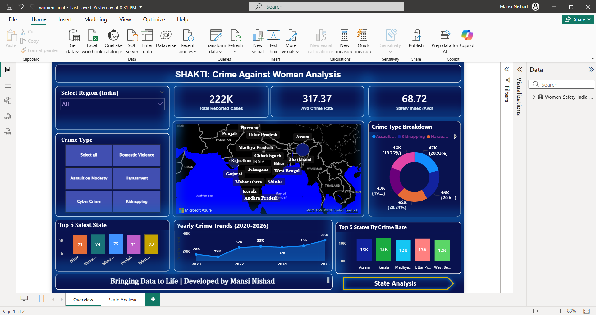

# 🛡️ SHAKTI: Crime Against Women Analysis Dashboard
### Power BI Project | Developed by Mansi Nishad

---

## 📁 Project Overview

An interactive Power BI Dashboard analyzing crime trends against 
women across Indian states — covering Domestic Violence, Harassment, 
Cyber Crime, Kidnapping & Assault on Modesty.

---

## 📷 Dashboard Preview

### Overview Page

### State Analysis Page

---

## 🛠 Tools & Technologies Used
- Power BI Desktop
- Power Query
- DAX
- Data Modeling
- Data Visualization
- Microsoft Azure Maps

---

## 🎯 Key Features
- 📊 KPI Cards — Total Reported Cases, Avg Crime Rate, Safety Index
- 🗺️ Interactive India Map — State-wise crime visualization
- 🍩 Crime Type Breakdown — Donut chart
- 📈 Yearly Crime Trends (2020–2026)
- 🏆 Top 5 Safest States & Top 5 by Crime Rate
- 🔍 Decomposition Tree — State & Crime Type drill-down
- 🎛️ Dynamic Slicers — Region, Crime Type, Year, State

---

## 💡 Skills Demonstrated
Data Analytics · DAX · Power Query · Business Intelligence · 
Data Cleaning · KPI Analysis · Data Storytelling

---

> *"Bringing Data to Life" — Developed by Mansi Nishad* 💙
